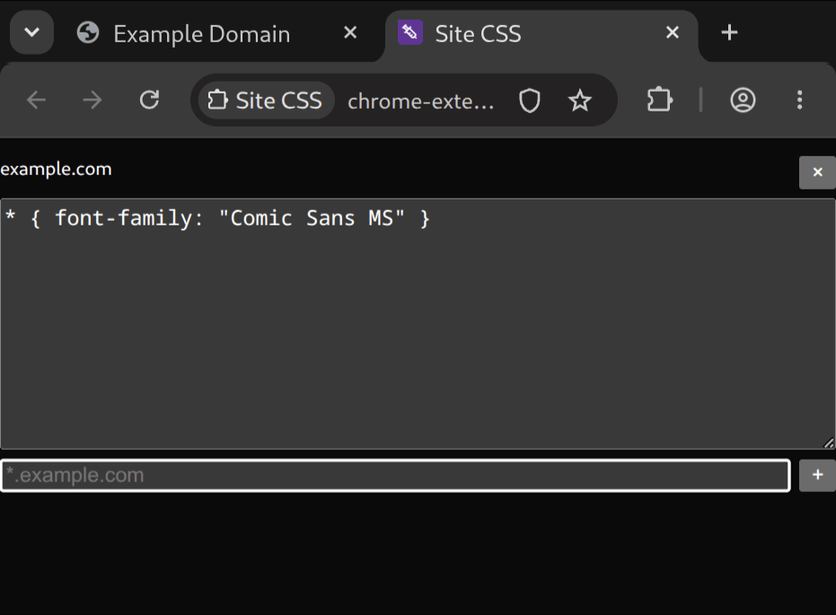
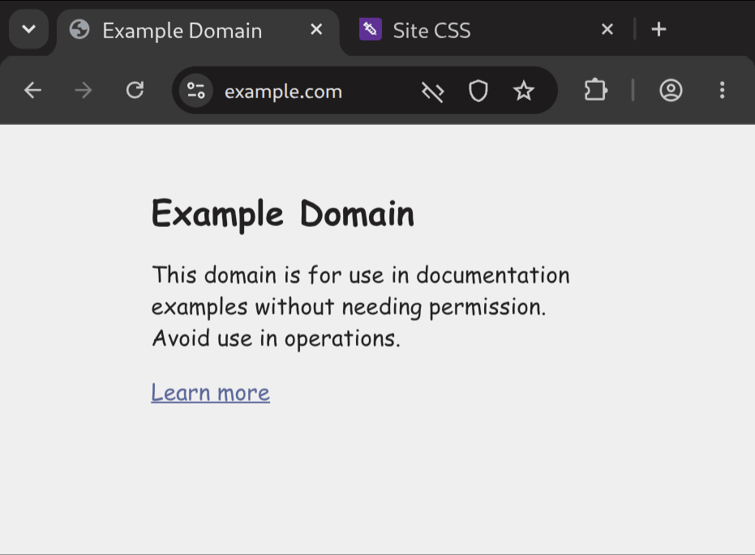

#  Site CSS

Site CSS is a minimal extension to apply custom user CSS to sites and pages you visit. Add a URL pattern (matching every page, a host, a specific page, or anything in between), paste in some CSS, and it applies every time you visit. ~~It's like Stylus but you don't have to be skeeved out about the `all_urls` content script because it's like 200 lines of code.~~

Site CSS does the Right Thing whenever possible:

- Extremely minimal, auditable implementation (no dependencies, build steps, or built-in autoformatters here)
- Styles sync via your browser profile and update live as you edit
- Styles apply before document load with no flash of unstyled content
- Styles are injected as user-origin CSS as in the halcyon days of `userContent.css`: Site CSS rules < page rules < page `!important` rules < Site CSS `!important` rules
- Efficient filter implementation so pages without custom styles don't slow down
- Works in iframes and on file:// urls
- No account, no tracking, no data collection
- Open source and public domain (CC0)

No Web Store, yet... Clone/download, Extensions > Load Unpacked.

# Usage

Click the extension icon to view and edit your overrides. Add an override for a site (e.g. `*.substack.com` or `example.com/docs/*`) or any [URL pattern](https://urlpattern.spec.whatwg.org/) (e.g. `https://*.example.com/docs/*`).

# License

CC0-1.0.
